## Descripción de la arquitectura del software

La arquitectura se divide en dos capas: una **capa en C** y una **capa en ensamblador RISC-V**.  
La capa en C se encarga de la interacción con UART, la impresión de resultados, la definición de vectores de prueba y la validación de salidas esperadas. En cambio, la capa en ensamblador implementa la lógica criptográfica de ChaCha20.

### Interfaces definidas

La comunicación entre ambas capas se realiza mediante tres funciones externas:

```c
extern void quarter_round(void);
extern uint32_t *block(const uint32_t *key, const uint32_t *nonce, uint32_t counter, uint32_t *out);
extern uint8_t *chacha20_encrypt(const uint32_t *key, const uint32_t *nonce, uint32_t counter,
                                 const uint8_t *plaintext, uint32_t len, uint8_t *out);
```

- `quarter_round` implementa la operación básica de ChaCha20 sobre cuatro palabras de 32 bits.
- `block` construye y procesa el estado completo de 16 palabras para generar un bloque de keystream de 64 bytes.
- `chacha20_encrypt` usa `block` para cifrar o descifrar mensajes completos mediante XOR con el keystream.

### Justificación de decisiones de diseño

Se usan `uint32_t` en `key`, `nonce`, `counter` y en la salida de `block` porque ChaCha20 trabaja internamente con **palabras de 32 bits**. Esto evita conversiones innecesarias y hace que la interfaz coincida directamente con la estructura del estado del algoritmo.

En cambio, `plaintext`, `ciphertext` y la salida de `chacha20_encrypt` se manejan como `uint8_t`, porque el cifrado final opera sobre **bytes**. Aunque el bloque interno se genera en palabras de 32 bits, el mensaje se procesa byte a byte mediante XOR, por lo que esta representación es la más natural para entrada y salida.

En `quarter_round` se usan registros porque la operación solo requiere cuatro palabras y varias transformaciones rápidas sobre ellas. En `block`, en cambio, se usa memoria en el stack para guardar tanto el **estado original** como el **estado de trabajo**, ya que el algoritmo necesita conservar ambos para la suma final y además manipula 16 palabras, una cantidad mayor a la que resulta práctica mantener únicamente en registros.

También se definieron buffers de salida explícitos en `block` y `chacha20_encrypt` para simplificar la integración con C y evitar depender de múltiples valores de retorno. En `chacha20_encrypt`, además, se reserva espacio temporal en stack para el último bloque incompleto, lo que permite reutilizar la rutina `block` sin duplicar lógica.

## Evidencias de ejecución

A continuación se presentan los resultados obtenidos durante la ejecución de un ejemplo de `chacha20_encrypt`.

### 1. Carga inicial de parámetros

Inicialmente se guardan el `key`, `nonce` y `plaintext` en el stack. Como el `counter` es un valor único, se guarda directamente en el registro. Para esto se utilizan los registros `s4`, `s5`, `s6` y `s7`.

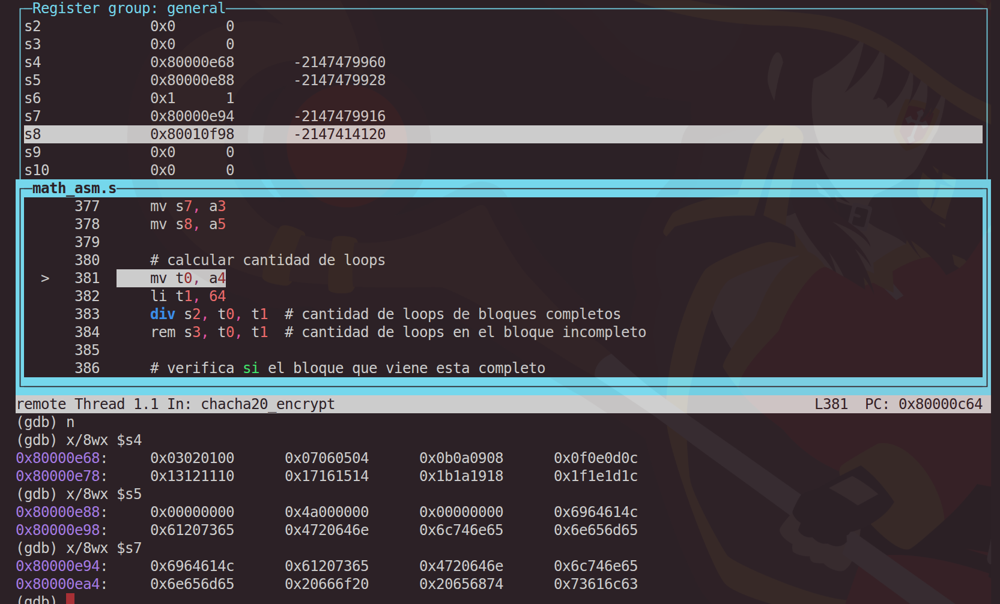

### 2. Generación de bloques

Luego de esto se puede ver la generación de los bloques, los cuales también se guardan en el stack. Nótese que la única diferencia entre los bloques antes de trabajarse es el `counter`, el cual aumenta en 1.

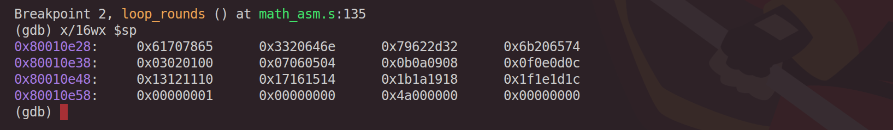

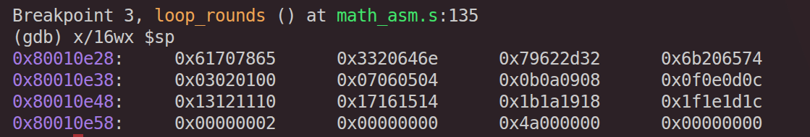

### 3. Working state y suma final

Luego de generar el bloque, se crea una copia (`working_state`) dentro del stack. Este se opera siguiendo el algoritmo establecido con los `quarter_round`. Finalmente, se realiza la suma final del `working_state` con el `original_state`, quedando este resultado.

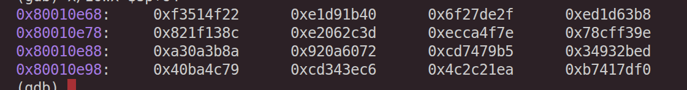

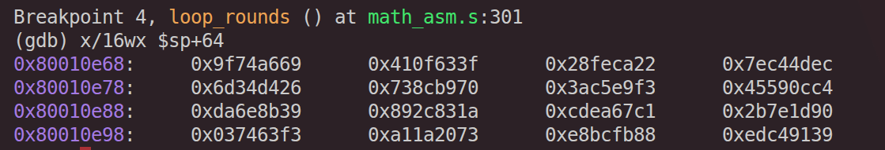

### 4. Generación del keystream

Podemos ver también la generación del `keystream`. Para este caso específico, por ser un `plaintext` de tamaño de 114 bytes, se procesa un bloque completo y luego un bloque incompleto. Por lo tanto, primero se genera la parte del `keystream` correspondiente al bloque completo y luego la proporcionada por el bloque incompleto.

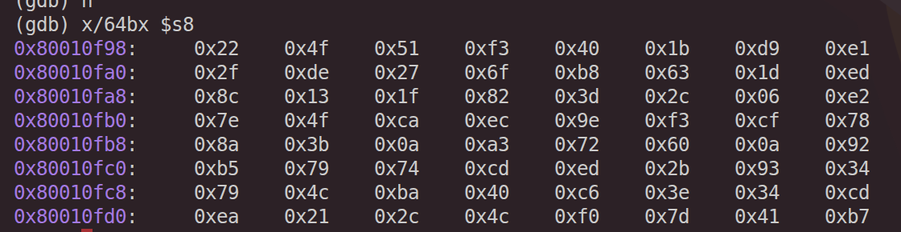

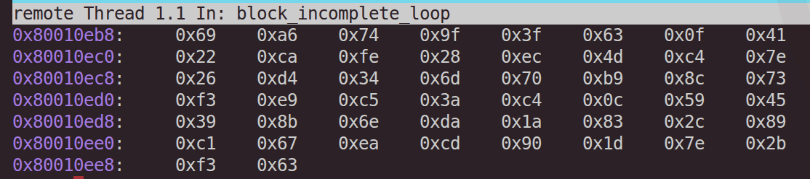

### 5. Obtención del ciphertext

Finalmente, al realizar el `xor` entre el `keystream` y el `plaintext` original, se obtiene el siguiente cifrado:

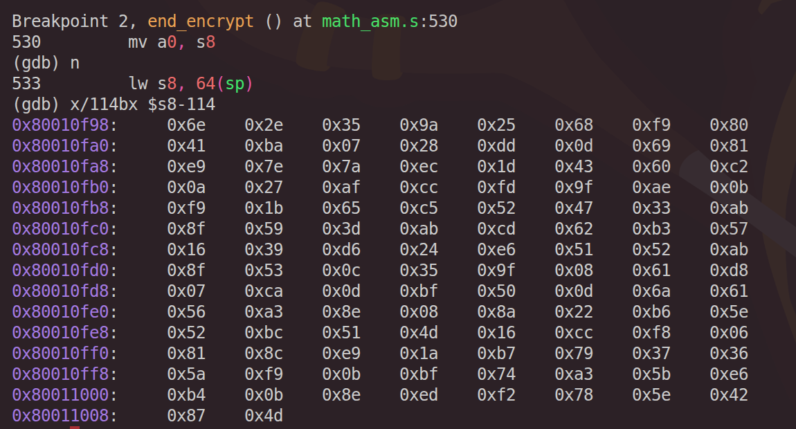

## Mapeo entre estados y registros

En esta implementación, el estado de ChaCha20 de 16 palabras de 32 bits **no se mantiene de forma permanente en registros**. En su lugar, se usa un esquema mixto donde el **estado completo se almacena en memoria (stack)** y únicamente las **4 palabras activas** de cada llamada a `quarter_round` se cargan temporalmente en registros. Esta decisión reduce la presión sobre el banco de registros y simplifica la reutilización de la rutina `quarter_round`.

### Organización del estado en memoria

Dentro de `block`, el stack guarda dos copias del estado:

| Rango en stack | Contenido |
|---|---|
| `0(sp)` a `60(sp)` | estado original `x0` a `x15` |
| `64(sp)` a `124(sp)` | estado de trabajo `x0` a `x15` |

La copia original se conserva para realizar la **suma final** del algoritmo, mientras que la copia de trabajo es la que se modifica durante las 20 rondas.

### Mapeo de palabras en registros durante `quarter_round`

La función `quarter_round` recibe 4 palabras mediante los registros de argumentos:

| Registro | Significado |
|---|---|
| `a0` | palabra `a` |
| `a1` | palabra `b` |
| `a2` | palabra `c` |
| `a3` | palabra `d` |

Al inicio de la rutina, estas palabras se copian a registros temporales para operar con ellas:

| Registro temporal | Palabra almacenada |
|---|---|
| `t0` | `a` |
| `t1` | `b` |
| `t2` | `c` |
| `t3` | `d` |
| `t4`, `t5` | auxiliares para rotaciones |

Al finalizar, los resultados vuelven a `a0`–`a3`, lo que permite retornar las 4 palabras actualizadas al código llamador.

### Mapeo en rondas de columna

Durante las rondas de columna, las palabras del estado de trabajo se cargan así:

| Quarter round | `a0` | `a1` | `a2` | `a3` |
|---|---|---|---|---|
| 1 | `x0` | `x4` | `x8`  | `x12` |
| 2 | `x1` | `x5` | `x9`  | `x13` |
| 3 | `x2` | `x6` | `x10` | `x14` |
| 4 | `x3` | `x7` | `x11` | `x15` |

### Mapeo en rondas diagonales

Durante las rondas diagonales, el mapeo cambia para seguir la especificación de ChaCha20:

| Quarter round | `a0` | `a1` | `a2` | `a3` |
|---|---|---|---|---|
| 1 | `x0` | `x5` | `x10` | `x15` |
| 2 | `x1` | `x6` | `x11` | `x12` |
| 3 | `x2` | `x7` | `x8`  | `x13` |
| 4 | `x3` | `x4` | `x9`  | `x14` |

### Justificación del diseño

Este mapeo fue elegido porque permite:

- conservar el estado completo sin consumir demasiados registros,
- reutilizar una sola rutina `quarter_round` para columnas y diagonales,
- mantener un flujo claro entre **carga desde memoria → procesamiento en registros → escritura de regreso**.

En consecuencia, el diseño no asigna una palabra fija del estado a un registro fijo durante toda la ejecución, sino que utiliza un **mapeo temporal y controlado**, adecuado para una implementación modular en RISC-V.

## Bitácora de bug

Al realizar varios casos de prueba para la función ***chacha20_encrypt*** se encontró un error que hacía que al ingresar un **plaintext** con un tamaño inferior a los 64 bytes, el programa dejara de funcionar. Sin embargo, al ingresar **plaintext** de tamaño igual o superior a 64 bytes, el programa funcionaba con normalidad. Al realizar el debug se encontró que esto ocurría porque al recibir un bloque menor a 64 bytes, en el registro que almacena la cantidad de bloques enteros de 64 bytes que existen, se guarda un *0* (*s2*).

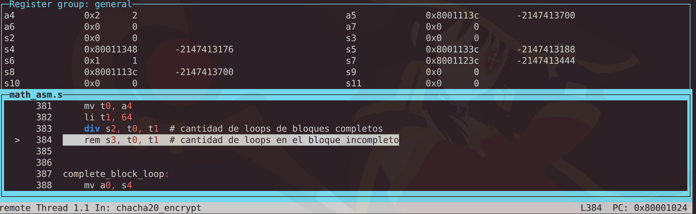

Lo que ocasionaba esto era que, al ingresar a ***complete_block_loop***, al finalizar el primer loop, se restara 1 y en el registro *s2* se almacenara un -1.

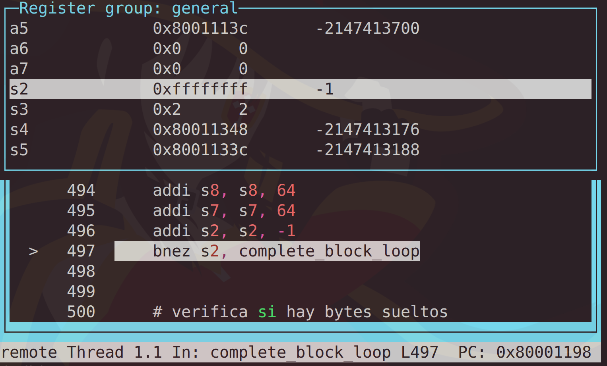

Como en el programa de ensamblador el condicional que frena el loop es un ***bnez***, esto ocasionaba que entrara en un ciclo infinito, pues nunca iba a ser 0, ya que en cada iteración se resta 1 por la naturaleza del loop.

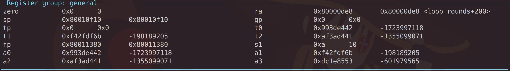

Para solucionar esto, se decidió incluir una instrucción que verifica si, al realizar el cálculo de los bloques completos, el registro **s2** tiene un 0 y, en caso de ser así, se desplaza a la verificación de bloques incompletos. Con esto se soluciona el problema de que con bloques de tamaño menor a 64 bytes el programa falle, pues al leer **0** en **s2** se trata como un bloque incompleto.

## Análisis de los resultados obtenidos

Los resultados obtenidos muestran que la implementación reproduce correctamente el comportamiento esperado del algoritmo ChaCha20. Esto se evidencia en la coincidencia entre los valores generados por el programa y los vectores de prueba oficiales, tanto en `quarter_round` como en `block` y `chacha20_encrypt`.

Además, las evidencias de ejecución permiten observar que la organización del estado en memoria, el uso temporal de registros y la generación del `keystream` siguen una secuencia coherente con la especificación del algoritmo. También se confirma que el cifrado final se obtiene correctamente al aplicar `xor` entre el `plaintext` y el `keystream`.